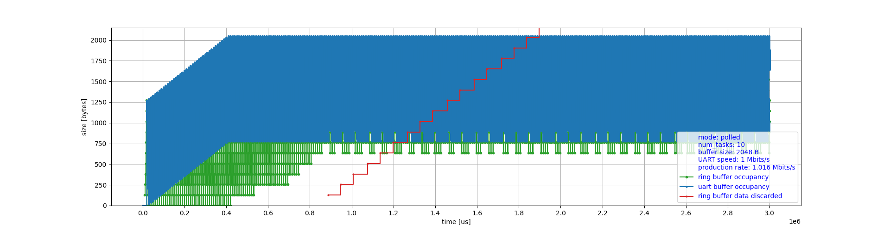
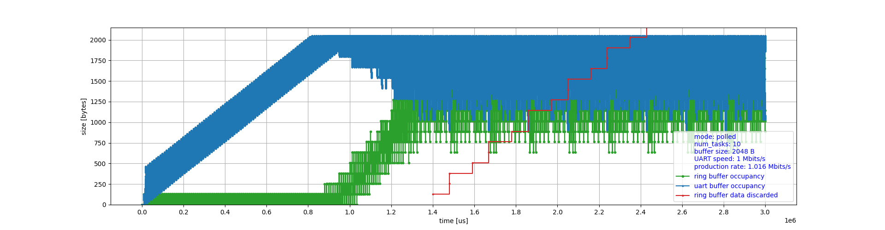
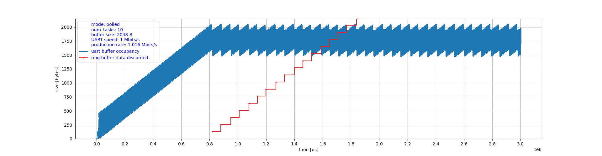
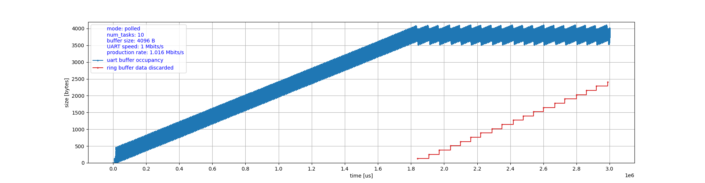

This is a discrete-event simulation (DES) of a simple polled
double-buffering system (multiple producers, single consumer)
in [SimPy](https://simpy.readthedocs.io/en/latest/).
Created in order to evaluate the impact of polled vs. asynchronous
'draining' methods. With the same memory allocated to buffers
and data producers the asynchronous 'draining' is almost twice
as capable when it comes to accommodating temporary data bursts.

